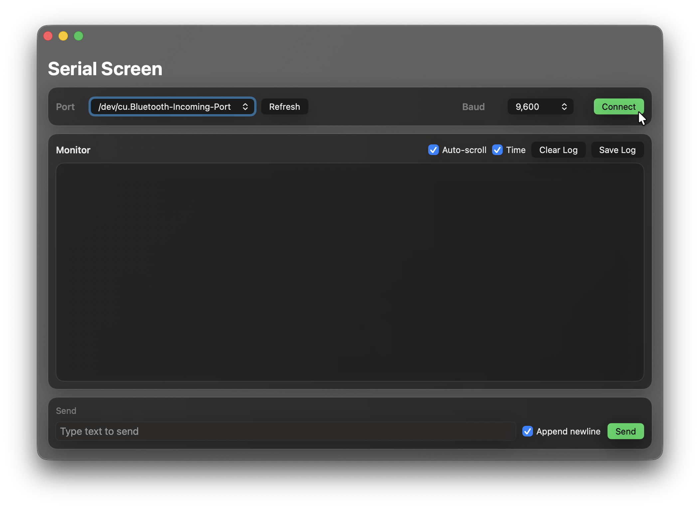

# Serial Screen



A native macOS serial monitor built with `Swift + SwiftUI`.

## Features
- Dark, semi-transparent macOS-style UI.
- Serial port and baud rate selection.
- `Refresh` serial port list.
- `Connect / Disconnect` controls.
- Live monitor for incoming data with selectable/copyable text.
- Optional timestamps (`[HH:mm:ss]`).
- Optional `Auto-scroll`.
- `Clear Log` and `Save Log` actions.
- Send text to serial port (`Enter` or `Send` button).
- Command history in the send field (`↑ / ↓`).
- `cu.*` and `tty.*` ports are de-duplicated (prefers `cu.*`).

## Requirements
- macOS 13+
- Swift 6.2 (`swift-tools-version: 6.2`)
- Xcode Command Line Tools

Check toolchain:
```bash
swift --version
```

## Quick Start
```bash
cd "/Users/elvin/Documents/My Projects/SerialScreen"
swift run SerialScreen
```

## Build

### Debug build
```bash
swift build
```

### Production `.app` + install to Applications
```bash
./scripts/build_macos_app.sh
```

After build:
- `dist/SerialScreen.app`
- `/Applications/SerialScreen.app`

Launch:
```bash
open /Applications/SerialScreen.app
```

## Usage
1. Click `Refresh`.
2. Select a `Port`.
3. Select `Baud` (default is `9600`).
4. Click `Connect`.
5. Type commands in `Send` and press `Enter`.

## Send Field Shortcuts
- `Enter` - send command.
- `↑` - previous command from history.
- `↓` - next command from history.

## Project Structure
```text
SerialScreen/
├── Assets/
│   └── icon.icns
├── Sources/
│   └── SerialScreen/
│       └── SerialScreen.swift
├── scripts/
│   └── build_macos_app.sh
├── Package.swift
└── README.md
```

## Troubleshooting
- If no ports appear, verify the device connection and click `Refresh` again.
- If copying to `/Applications` fails due to permissions:
```bash
sudo cp -R "./dist/SerialScreen.app" /Applications/
```
- If macOS blocks launching an unsigned app:
```bash
xattr -dr com.apple.quarantine /Applications/SerialScreen.app
```
